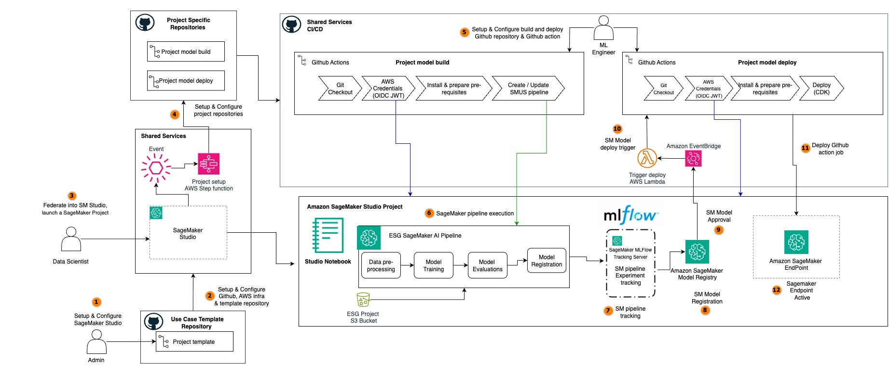

# 🚀 SageMaker LLMOps Platform for HuggingFace Model Fine-Tuning

> **Reference MLOps implementation for fine-tuning and deploying HuggingFace language models on AWS SageMaker**

A reusable accelerator that demonstrates LLM lifecycle orchestration from model fine-tuning to deployment, with automated GitHub repository creation, CI/CD pipelines, and monitoring capabilities. This serves as a foundation that can be customized and hardened for your specific production requirements.

## 📋 What This Platform Provides

This is a **generic LLMOps platform** that can be used for any HuggingFace language model fine-tuning project. It provides:

### Platform Components (Deployed Once, Shared Across Projects)

- **SageMaker Studio Domain** - Development environment for data scientists
- **GitHub Integration** - Automated repository creation with OIDC authentication
- **MLflow Tracking** - Centralized experiment tracking and model registry
- **Event-Driven Automation** - EventBridge + Lambda + Step Functions orchestration
- **Observability Stack** - CloudWatch dashboards, SNS notifications, Slack integration

### Project Templates (Instantiated Per Use Case)

- **CloudFormation Template** - Creates project-specific resources (Model Package Group, S3 buckets)
- **Seed Code Repositories** - Pre-configured training and deployment pipelines
- **GitHub Actions Workflows** - CI/CD automation for model lifecycle

### Included Example: ESG Report Summarization

The platform includes a complete example demonstrating fine-tuning Mistral-7B for ESG sustainability report summarization. This serves as a reference implementation showing how to use the platform for your own use cases.

## 🔧 Configuration

### Required Configuration

Before deploying, you **must** configure your target GitHub organization where project repositories will be created:

> **Important:** This platform is designed as a reference implementation and accelerator. Review and customize the configuration for your specific security, compliance, and operational requirements before use.

```bash
# REQUIRED: Set your target GitHub organization
export TARGET_GITHUB_ORG="your-github-org"

# REQUIRED: Set your GitHub Personal Access Token
export GITHUB_TOKEN="ghp_your_github_token_here"
```

**Why is TARGET_GITHUB_ORG required?**

- This is where the platform will create repositories for each SageMaker project
- There is no sensible default - it must be your organization
- The platform will fail to deploy without this configuration

### Optional Configuration

The platform uses sensible defaults, but you can customize if needed:

```python
# Edit sm-cdk/llmops_sm/config.py

GitConfig(
    # Template source (defaults to aws-samples for production)
    template_github_org="aws-samples",  # Where to get seed code templates
    template_github_repo="llmops-finetuning-foundation",
    template_code_folder="seed-code",

    # Target organization (REQUIRED - set via environment variable)
    target_github_org=None,  # Set via TARGET_GITHUB_ORG env var

    # GitHub token (stored in AWS Secrets Manager)
    github_token_secret_name="llmops-sm-github-token",
)
```

**Parameter Definitions:**

- `template_github_org`: Organization hosting the seed code templates (default: `aws-samples` for reference templates)
- `template_github_repo`: Repository containing seed code templates
- `template_code_folder`: Folder within template repo containing seed code
- `target_github_org`: **YOUR** organization where project repos will be created (REQUIRED)

**For Custom Templates:**
If you've forked this repository to customize templates for your organization:

```bash
export TEMPLATE_GITHUB_ORG="your-custom-org"
```

## ⚡ Quick Start

Deploy the complete LLMOps platform with a single command:

```bash
# 1. Set required environment variables
export TARGET_GITHUB_ORG="your-github-org"
export GITHUB_TOKEN="ghp_your_github_token_here"

# 2. (Optional) Set AWS region - defaults to your configured AWS CLI region
aws configure set region us-west-2

# 3. Ensure Docker Desktop is running
docker info

# 4. Deploy everything (handles CDK bootstrap, Docker images, and all 3 stacks)
make deploy
```

The `make deploy` command automatically handles CDK bootstrap, pulls required Docker images, validates environment variables, and deploys all infrastructure in the correct order.

## 🏗️ What This Platform Does

This platform automatically creates a complete MLOps workflow when you create a SageMaker project:

## Architecture Overview

The ESG benchmarking model build pipeline follows a comprehensive MLOps architecture that integrates GitHub Actions with SageMaker services for automated model training and registration.



### 🔄 **Automated Workflow**

1. **Create SageMaker Project** → Platform detects project creation
2. **Auto-Generate Repositories** → Creates build & deploy repos with seed code
3. **Train Models** → Push code triggers automated training pipelines
4. **Register Models** → Successful training registers models in Model Registry
5. **Deploy Models** → Model approval triggers automated deployment workflows

### 🛠️ **Key Features**

- ✅ **Streamlined Setup** - Simplified deployment with `make deploy`
- ✅ **End-to-End Automation** - From code commit to model deployment
- ✅ **MLflow Integration** - Experiment tracking and model registry
- ✅ **Monitoring Capabilities** - CloudWatch dashboards and metrics
- ✅ **Security Foundations** - IAM roles, VPC isolation, secrets management
- ✅ **Resource Configuration** - Environment-specific resource sizing

**Note:** This is a reference implementation. Additional hardening, security reviews, and customization are recommended before deploying to production environments.

### Key AWS Components:

- **SageMaker Pipelines**: Orchestrated ML workflows for data processing, training, and evaluation
- **SageMaker Model Registry**: Centralized model versioning and approval workflow for trained ESG models
- **S3 Storage**: Artifact storage for datasets, models, and pipeline outputs
- **IAM Roles**: Secure cross-service authentication using OIDC and execution roles

## 🏗️ Platform Architecture

### Two-Layer Design

The platform uses a **two-layer architecture** to separate reusable infrastructure from project-specific templates:

#### Layer 1: Platform Infrastructure (Deployed Once)

```
┌─────────────────────────────────────────────────────────────────┐
│                    LLMOps Platform (Shared)                     │
├─────────────────────────────────────────────────────────────────┤
│  🏢 SageMaker Domain Stack                                      │
│     ├── Studio Domain & User Profiles                          │
│     ├── Execution Roles & Permissions                          │
│     └── Shared S3 Buckets                                      │
├─────────────────────────────────────────────────────────────────┤
│  ⚙️  Infrastructure Stack                                       │
│     ├── EventBridge Rules (project creation, model approval)   │
│     ├── Lambda Functions (GitHub repo management)              │
│     ├── Step Functions (orchestration workflows)               │
│     ├── GitHub OIDC Provider & IAM Roles                       │
│     └── Service Catalog Portfolio                              │
├─────────────────────────────────────────────────────────────────┤
│  📊 Observability Stack                                         │
│     ├── MLflow Tracking Server (ECS Fargate)                   │
│     ├── CloudWatch Dashboards                                  │
│     └── SNS/Slack Notifications                                │
└─────────────────────────────────────────────────────────────────┘
```

#### Layer 2: Project Templates (Instantiated Per Project)

```
┌─────────────────────────────────────────────────────────────────┐
│              Project Template (Per Use Case)                    │
├─────────────────────────────────────────────────────────────────┤
│  📄 CloudFormation Template                                     │
│     ├── Model Package Group (for model versioning)             │
│     ├── Project-specific S3 Buckets                            │
│     └── Resource Tags (project-id, project-name)               │
├─────────────────────────────────────────────────────────────────┤
│  🔄 Event-Driven Workflow (Triggered by EventBridge)           │
│     ├── Step Functions: Orchestrates repo creation             │
│     ├── Lambda: Creates GitHub repositories                    │
│     ├── Lambda: Populates repos with seed code                 │
│     └── Lambda: Configures GitHub Actions variables            │
├─────────────────────────────────────────────────────────────────┤
│  📦 Seed Code (Copied to GitHub Repos)                         │
│     ├── model_build/ - Training pipeline                       │
│     │   ├── SageMaker Pipelines definition                     │
│     │   ├── Training scripts                                   │
│     │   └── GitHub Actions workflows                           │
│     └── model_deploy/ - Deployment pipeline                    │
│         ├── CDK stack for endpoints                            │
│         └── GitHub Actions workflows                           │
└─────────────────────────────────────────────────────────────────┘
```

### Why This Architecture?

**Q: Why split the template between CloudFormation and Step Functions?**

A: CloudFormation templates in SageMaker Projects have limitations:

- Cannot directly interact with external APIs (like GitHub)
- Limited to AWS resource creation
- No built-in retry logic for complex workflows

The Step Functions + Lambda approach provides:

- ✅ GitHub API integration for repository management
- ✅ Asynchronous processing with automatic retries
- ✅ Complex orchestration logic (check project status, create repos, sync code)
- ✅ Extensibility for future integrations (GitLab, Bitbucket, etc.)

**Q: What's shared vs. project-specific?**

**Shared (Platform Layer):**

- SageMaker Domain, MLflow server, EventBridge rules, Lambda functions
- Deployed once, used by all projects
- Changes require platform redeployment

**Project-Specific (Template Layer):**

- Model Package Group, project S3 buckets, GitHub repositories
- Created per project instantiation
- Each project is isolated

**Q: How do I add a new template (e.g., for computer vision)?**

1. Create new CloudFormation template in `sm-cdk/templates/`
2. Add new seed code folder in `seed-code/`
3. Register template in Service Catalog (in `main_stack.py`)
4. Platform infrastructure remains unchanged

## 📁 Repository Structure

```
llmops-finetuning-foundation/
├── 📄 README.md                    # Platform overview (this file)
├── 🔧 Makefile                     # One-command deployment
│
├── 🌱 seed-code/                   # Template code for new projects
│   └── esg-benchmarking/           # Example: ESG report summarization
│       ├── model_build/            # Training pipeline template
│       │   ├── ml_pipelines/       # SageMaker Pipelines definitions
│       │   └── source_scripts/     # Training, preprocessing, evaluation
│       └── model_deploy/           # Deployment pipeline template
│           ├── deploy_endpoint/    # CDK stack for SageMaker endpoints
│           └── src/                # Inference code
│
└── ☁️ sm-cdk/                      # Platform infrastructure (CDK)
    ├── app.py                      # CDK application entry point
    ├── lambda/                     # Lambda function implementations
    │   ├── check-project-status/   # Monitors project creation
    │   ├── create-deploy-repository/ # Creates GitHub repos
    │   ├── sync-repositories/      # Populates repos with seed code
    │   └── model-approval-trigger/ # Triggers deployment on approval
    ├── llmops_sm/                  # Core platform implementation
    │   ├── config.py               # Platform configuration
    │   ├── constructs/             # Reusable CDK constructs
    │   └── stacks/                 # Infrastructure stacks
    │       ├── sagemaker_domain_stack.py  # SageMaker Domain
    │       ├── main_stack.py              # EventBridge + Lambda
    │       └── observability_stack.py     # MLflow + Monitoring
    └── templates/                  # Service Catalog templates
        └── esg-project-template.yaml  # Example template
```

**Key Directories:**

- `seed-code/` - Template code copied to new GitHub repositories
- `sm-cdk/` - Platform infrastructure (deployed once)
- `sm-cdk/templates/` - Project templates (instantiated per project)

## 🚀 Getting Started

### Prerequisites

Before running `make deploy`, ensure you have:

- **AWS Account** with appropriate permissions
- **Docker Desktop** running
- **GitHub Organization** where repositories will be created
- **GitHub Personal Access Token** (see detailed permissions below)

### GitHub Personal Access Token (PAT) Requirements

The platform requires a GitHub Personal Access Token with **fine-grained permissions** to automate repository creation and management. You can create a token at: https://github.com/settings/tokens

#### **Required Fine-Grained Permissions**

When creating a **Fine-grained personal access token**, configure the following permissions:

##### **Repository Permissions** (for repositories the token can access)

| Permission         | Access Level   | Purpose                                                                              |
| ------------------ | -------------- | ------------------------------------------------------------------------------------ |
| **Contents**       | Read and Write | Download template repository contents, create/update files in generated repositories |
| **Metadata**       | Read-only      | Access repository metadata (automatically included)                                  |
| **Administration** | Read and Write | Create new repositories in your organization or user account                         |
| **Variables**      | Read and Write | Create and update GitHub Actions repository variables for pipeline configuration     |

##### **Organization Permissions** (if using an organization)

| Permission         | Access Level   | Purpose                                                   |
| ------------------ | -------------- | --------------------------------------------------------- |
| **Administration** | Read and Write | Create repositories within the organization               |
| **Members**        | Read-only      | Verify organization membership (optional but recommended) |

#### **Token Scope Configuration**

1. **Token Name**: `llmops-platform-automation` (or your preferred name)
2. **Expiration**: Choose based on your security policy (90 days recommended)
3. **Repository Access**:
   - **All repositories** (if you want the platform to access any repo), OR
   - **Only select repositories** (specify your template repository)
4. **Permissions**: Set the permissions listed above

#### **Classic Token Alternative**

If using a **Classic Personal Access Token** (not recommended for production), select these scopes:

- ✅ `repo` (Full control of private repositories)
  - Includes: `repo:status`, `repo_deployment`, `public_repo`, `repo:invite`, `security_events`
- ✅ `workflow` (Update GitHub Action workflows)
- ✅ `admin:org` → `write:org` (Create repositories in organization)
- ✅ `admin:repo_hook` → `write:repo_hook` (Write repository hooks)

#### **What the Platform Does With Your Token**

The Lambda functions use your GitHub token to:

1. **Repository Operations**:

   - Create new private repositories for each SageMaker project
   - Download template code from the source repository
   - Upload seed code files to newly created repositories
   - Create and update files via GitHub API

2. **Configuration Management**:

   - Create GitHub Actions repository variables (not secrets)
   - Configure pipeline parameters (S3 paths, AWS regions, role ARNs, etc.)
   - Set up project-specific environment configuration

3. **Content Synchronization**:
   - Fetch repository tree structures
   - Create Git blobs, trees, and commits
   - Update branch references
   - Sync template folder contents to target repositories

#### **Security Considerations**

- 🔒 **Store Securely**: The token is stored in AWS Secrets Manager, never in code
- 🔄 **Rotate Regularly**: Set token expiration and rotate before expiry
- 📊 **Monitor Usage**: Review token usage in GitHub settings regularly
- 🎯 **Least Privilege**: Use fine-grained tokens with minimum required permissions
- 🚫 **Never Commit**: Never commit tokens to version control
- 📝 **Audit Trail**: GitHub logs all API operations performed with the token

> **Note:** Additional security hardening may be required for your organization's specific compliance and security requirements.

#### **Troubleshooting Token Issues**

| Error                      | Cause                         | Solution                                         |
| -------------------------- | ----------------------------- | ------------------------------------------------ |
| `401 Unauthorized`         | Token invalid or expired      | Regenerate token and update in Secrets Manager   |
| `403 Forbidden`            | Insufficient permissions      | Add missing permissions to token                 |
| `404 Not Found`            | Token can't access repository | Grant token access to template repository        |
| `422 Unprocessable Entity` | Repository already exists     | Delete existing repository or use different name |

### Step 1: Configure Your Environment

```bash
# Clone the repository
git clone https://github.com/aws-samples/sample-smai-llmops.git
cd sample-smai-llmops

# Set required GitHub token
export GITHUB_TOKEN="ghp_your_github_personal_access_token"

# Verify Docker is running
docker info
```

### Step 2: Deploy the Platform

```bash
# Deploy everything with one command
make deploy
```

This command will:

- ✅ Set up Python virtual environment
- ✅ Install all dependencies
- ✅ Build Lambda layers
- ✅ Bootstrap CDK environment
- ✅ Deploy all three stacks in correct order
- ✅ Configure GitHub integration

### Step 3: Create Your First Project

1. **Open SageMaker Studio**

   ```bash
   # Get your domain URL from the deployment output
   aws sagemaker list-domains --query 'Domains[0].Url' --output text
   ```

2. **Create New Project**

   - Go to SageMaker Studio → Projects
   - Click "Create Project"
   - Select "ESG Benchmarking Template"
   - Enter project name (e.g., `my-esg-model`)

3. **Automated Repository Setup** ✨
   - Platform automatically creates GitHub repositories
   - Populates them with ESG seed code
   - Sets up CI/CD workflows
   - Configures necessary variables and secrets

### Step 4: Train Your First Model

```bash
# Clone your auto-generated build repository
git clone https://github.com/YOUR_ORG/my-esg-model-build.git
cd my-esg-model-build

# Make a change to trigger training
echo "# Updated model" >> README.md
git add . && git commit -m "Trigger training pipeline"
git push

# Watch training progress in GitHub Actions
```

## 🛠️ Available Commands

### Setup & Deployment

```bash
make setup          # Complete project setup
make bootstrap      # Bootstrap CDK environment
make deploy         # Deploy all stacks
make deploy-domain  # Deploy SageMaker Domain only
```

## 🧹 Cleanup

To completely remove the platform:

```bash
# Clean up all resources
make clean-all

# Or step by step
make clean-endpoints    # Remove SageMaker endpoints
make clean-projects     # Remove SageMaker projects
make destroy-stack      # Remove CDK stacks
```

## 📚 Documentation

- **[Seed Code Templates](seed-code/README.md)** - Template repositories and use cases
- **[Model Build Pipeline](seed-code/esg-benchmarking/model_build/README.md)** - Training pipeline documentation
- **[Model Deploy Pipeline](seed-code/esg-benchmarking/model_deploy/README.md)** - Deployment pipeline documentation
